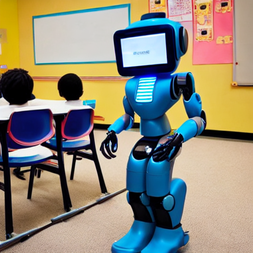

# Generative AI Internship - Task 2

## 🎯 Task Objective
Utilize pre-trained generative models like **Stable Diffusion** to generate high-quality images from text prompts.

---

## 🧠 Model Used
- Model: [`runwayml/stable-diffusion-v1-5`](https://huggingface.co/runwayml/stable-diffusion-v1-5)
- Framework: 🤗 Hugging Face Diffusers
- Platform: Google Colab
- Device: GPU

---

## 🖊️ Text Prompt Used
"a futuristic robot teaching in a classroom"
---

## 📷 Output

---

## 📁 Project Files

- `generate_image.ipynb` – Colab notebook used for generating the image
- `generated_image.png` – Output image based on the prompt
- `requirements.txt` – List of dependencies (optional)

---

## 🚀 How to Use

1. Open the notebook in Google Colab.
2. Install dependencies (first cell).
3. Login using Hugging Face token.
4. Set your prompt and run all cells.
5. View and download your generated image.

---

## 🛠 Requirements (install with pip)

diffusers
transformers
torch
accelerate
scipy
safetensors
